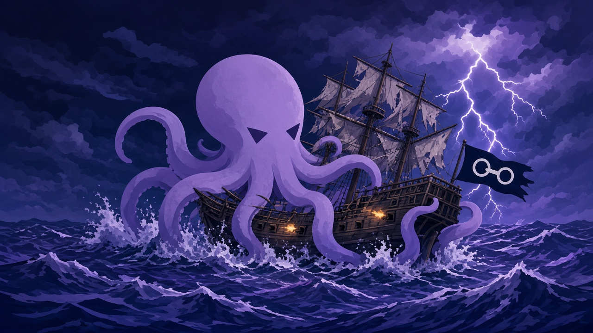

# Kraken 1.0

  

**A Playnite-style Steam catalog.** Browse games on Home, open a title for Store details, queue a download, then play in Steam.

[Download the latest release](https://github.com/haker146/Kraken/releases/latest) · [GitHub](https://github.com/haker146/Kraken)

Educational use only. Use at your own risk. Kraken is a user-facing continuation of the SteaMidra/SFF codebase and stays GPL-3.

> Antivirus note: some AVs flag a packed desktop exe as a generic false positive. Source is open at [github.com/haker146/Kraken](https://github.com/haker146/Kraken). To add an exclusion: **Windows Security → Virus & threat protection → Manage settings → Exclusions → Add a folder**.

Need help? Discord: https://discord.gg/steamidra

---

## What 1.0 gives you

- **Home** — hero slider plus cover shelves (recently updated, newest, installed, favorites, recently viewed).
- **Game details** — Steam Store description, release date, screenshots, trailer, DLC names, latest public build, Download, and **Play in Steam** (`steam://rungameid/`).
- **Store** — search the catalog, Update List, pagination. Card click opens details; Download still uses the existing modal.
- **Tools** — LumaCore/setup actions, game picker, generators (moved off Home).
- **Library / Downloads / Fix Game / Cloud Saves** — same pipelines as before; play-in-Steam from Library.
- Steam status chip in the sidebar. Stale-catalog banner. Disk-space warning before large downloads.

Kraken does not replace Steam. After a game is added, launch and library life stay in the Steam client.

---

## Quick start

### Windows

1. Download `Kraken-1.0.0-Setup.exe` or `Kraken-1.0.0-windows.zip` from [Releases](https://github.com/haker146/Kraken/releases/latest). Run `Kraken_GUI.exe`.
2. Open **Tools** → **Auto LC Setup** to install LumaCore into your Steam folder (Windows only).
3. Set the Steam path in **Settings** if it was not detected. Use the sidebar chip to confirm Steam is found.
4. On **Home** or **Store**, open a game → **Download**. When it is installed, **Play in Steam**.

Python from source: [docs/PYTHON_SETUP.md](docs/PYTHON_SETUP.md).

### Linux

LumaCore is Windows-only. On Linux, Kraken uses **SLSsteam** + **SLScheevo**. Grab `Kraken-*-linux.zip` or the AppImage from Releases, then **Tools** → **Linux Setup**. Full notes: [docs/LINUX_SETUP.md](docs/LINUX_SETUP.md).

---

## GUI

PyQt6 + QWebEngine. Sidebar: Home, Tools, Store, Library, Downloads, Downgrade, Fix Game, Cloud Saves, Linux Guide, Settings.

**Store** remains the main way to find and download games (Hubcap manifests, depot keys, latest via Steam or older builds via DepotDownloaderMod). Search runs on Enter or Search.

Older SteaMidra tutorials still apply for LumaCore and API keys:

- [Setup walkthrough by @yensnc](https://www.reddit.com/user/YensNC/comments/1ttw2mm/tutorial_guide_on_installing_steamidra/)
- [API key screenshots by @novoagain](https://imgur.com/a/ubLeqer)

---

<meta name="google-site-verification" content="oOhPj88p1-6N3x5RWmGfNAbU5INE3sPDXUvEwoVeDZc" />

Full changelog: [CHANGELOG.md](CHANGELOG.md)

---

## Documentation

[Documentation index](docs/README.md) – Start here.

[Setup Guide](docs/SETUP_GUIDE.md) – What to install (including LumaCore).

[User Guide](docs/USER_GUIDE.md) – What each menu option does and how to add games.

[Quick Reference](docs/QUICK_REFERENCE.md) – Commands and shortcuts.

[Feature Guide](docs/FEATURE_USAGE_GUIDE.md) – Parallel downloads, backups, library scanner, and more.

[Multiplayer Fix](docs/MULTIPLAYER_FIX.md) – Searching online-fix.me and opening the result in your browser.

[Fixes & Bypasses](docs/CRACK_FIX.md) – Searching and applying community-maintained fixes from the data branch catalog. No API key, no account.

[Crack catalog — Fixes & Bypasses source](docs/CRACK_FILES.md) – How Kraken fetches `crackfiles.json` from the `Konungs-skuggsjá` branch, and a breakdown of every field in the fix list.

[DLC Unlockers](docs/dlc_unlockers/README.md) – Using DLC unlockers (CreamInstaller-style).

[Troubleshooting](docs/TROUBLESHOOTING.md) – Common problems and solutions.

[Python Setup](docs/PYTHON_SETUP.md) – Running or building from source.

---

## Troubleshooting

See [docs/TROUBLESHOOTING.md](docs/TROUBLESHOOTING.md) for common problems and solutions.

---

## Credits and third-party notices

**Made by Midrag and his brother.**

SteaMidra uses, integrates with, downloads, is compatible with, or was originally influenced by several third-party projects and community tools. Third-party tools, binaries, unlockers, emulators, assets, APIs, services, and earlier project bases remain owned by their original authors and keep their original licenses/terms. They are not relicensed as SteaMidra code.

SteaMidra’s GPL license applies to SteaMidra’s own source code only. It does not claim ownership over third-party components.

**SMD / Steam Manifest Downloader** – SteaMidra originally started from an early SMD base/fork. Credit to **Kur0 / the SMD project and contributors** for the original project structure, early workflow, and inspiration. Since then, SteaMidra has been heavily reworked and expanded with its own workflows, LumaCore integration, GUI/web UI, Store/search features, online fix handling, DLC unlocker handling, fixes/bypasses, backups, library scanner, Linux-related work, updater changes, and many other modules. Any remaining SMD-derived parts remain credited to their original authors/contributors and are not claimed as original SteaMidra code.

**LumaCore** – Windows DLL hook library bundled with SteaMidra. Injects into Steam at startup via a `dwmapi.dll` proxy, reads Lua files from `Steam/config/stplug-in/`, and patches Steam's in-memory license tables so games appear owned without AppList files or Steam restarts. [LumaCore](LumaCore/CREDITS.md)

**CreamAPI** – DLC unlocker by **deadmau5**. Used/handled only as a third-party unlocker component. CreamAPI remains owned by its original author and is not licensed as SteaMidra code.

**SmokeAPI / ScreamAPI** – DLC ownership emulation/unlocker projects by **Acidicoala**. Used/handled only as third-party unlocker components where applicable. These remain owned by their original author and are not licensed as SteaMidra code.

**Uplay R1/R2 Unlocker** – Uplay unlocker projects by **Acidicoala**. Used/handled only as third-party unlocker components where applicable. These remain owned by their original author and are not licensed as SteaMidra code.

**CreamInstaller** – The DLC Unlockers feature is inspired by and compatible with CreamInstaller-style behavior. SteaMidra does not ship CreamInstaller itself; it provides its own implementation for managing compatible unlocker setups. Credit to CreamInstaller and its maintainers for the original tool/flow inspiration.

**gbe_fork** – The "Crack a game" feature uses **gbe_fork**, a Steam emulator for running games offline. License in `third_party_licenses/gbe_fork.LICENSE`.

**gbe_fork tools** – Build and packaging tools for gbe_fork. License in `third_party_licenses/gbe_fork_tools.LICENSE`.

**Steamless** – The "Remove SteamStub DRM" feature uses **Steamless** by Atom0s for stripping Steam DRM from executables. License in `third_party_licenses/steamless.LICENSE`.

**fzf** – Used for fuzzy search in menus. License in `third_party_licenses/fzf.LICENSE`.

**SteamAutoCrack** – The SteamAutoCrack feature uses the **SteamAutoCrack CLI** by oureveryday. Bundled in `third_party/SteamAutoCrack/cli/`. License in `third_party_licenses/SteamAutoCrack.LICENSE`.

**DDMod / DepotDownloaderMod** – The Direct Download via DDMod feature uses **DepotDownloaderMod** by **oureveryday**. License in `third_party_licenses/DDMod.license`.

**headcrab / h3adcr-b** – The Linux SLSsteam auto-setup uses **headcrab** by **Deadboy666** (<https://github.com/Deadboy666/h3adcr-b>) as the primary installer. headcrab downloads and installs the latest SLSsteam release, patches Steam, and sets up the config. It is downloaded and run at setup time (not bundled). headcrab does not ship with a license; it remains owned by its original author.

**ManifestHub** – The ManifestHub source uses the manifest archive/API maintained by **oureveryday**.

**rclone** – Cloud Saves uses **rclone** for transfers to remote storage providers. License in `third_party_licenses/rclone.LICENSE`.

**online-fix.me** – The Multiplayer Fix feature searches online-fix.me for the selected game and opens the result in your browser. No credentials needed. SteaMidra is not affiliated with online-fix.me; files remain owned by their respective maintainers.

**Ludusavi** — The cloud save custom-path feature uses the **Ludusavi manifest** game-save-location database maintained by **mtkennerly** (<https://github.com/mtkennerly/ludusavi-manifest>). Bundled as `sff/data/manifest.yaml`.

**Hubcap Manifest** – Store browser and manifest library API provided by **Hubcap Manifest**. Community server: <https://discord.gg/hubcapsmanifest>

**Ryuu** – Lua and manifest download provider with reseller and premium API keys. Community server: <https://discord.gg/manifests>

**DepotBox** – Lua and manifest download provider. Also powers the Build ID lookup behind Download Older Version. Community server: <https://discord.gg/depotbox>

**RedPaper** – Credit to RedPaper for the Broken Moon MIDI cover, originally arranged by U2 Akiyama and used in Touhou 7.5: Immaterial and Missing Power. Touhou 7.5 and its assets are owned by Team Shanghai Alice and Twilight Frontier. SteaMidra is not affiliated with or endorsed by either party. All trademarks belong to their respective owners.

**Tutorials** – Setup walkthrough by **@yensnc**. API key tutorial by **@novoagain**.

README editing help by **itsphox**.

See `third_party_licenses/` and `THIRD_PARTY_NOTICES.md` for third-party license and provenance details.

## License scope

Kraken is a GPL-3 derivative of SteaMidra. SteaMidra’s own source remains under the GNU General Public License v3.0.

This license does not relicense third-party tools, binaries, unlockers, emulators, assets, APIs, services, or external projects used by, bundled with, downloaded by, or integrated with Kraken. Those components remain under their original authorship, licenses, and terms.

If any third-party credit, license notice, or ownership note is missing or unclear, please open an issue with the exact file/component and it will be reviewed.

## Disclaimer

This project is provided for research and educational purposes only. You are responsible for complying with local laws, platform terms of service, and software licenses.
